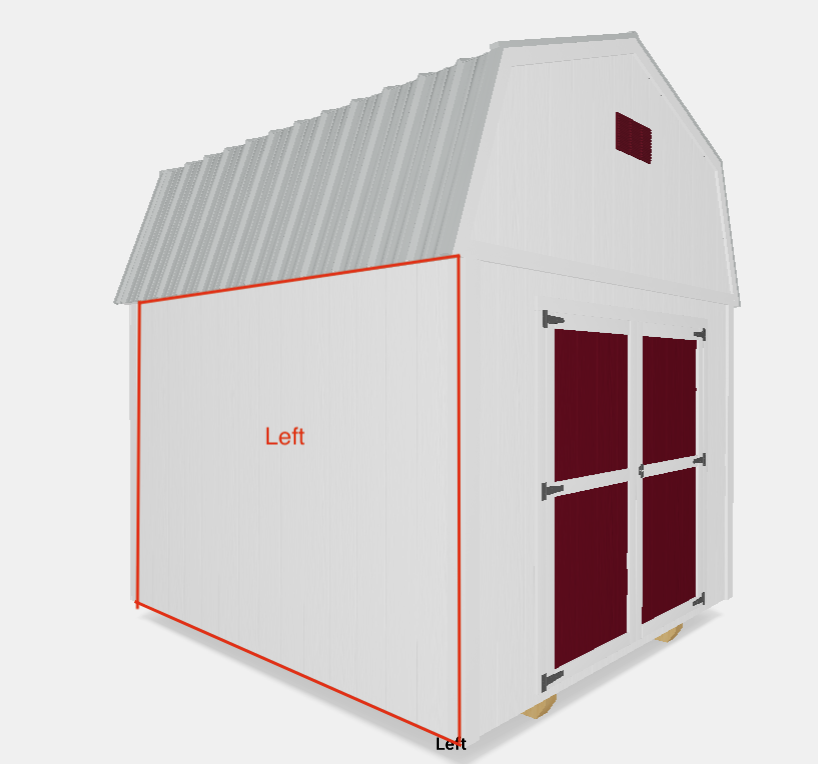

# Prueba Barn_Testing 

## Comenzando 🚀

_Estas instrucciones te permitirán Levantar el proyecto _

### Pre-requisitos 📋

Node.js, 
vsc,
nevegador

### Instalación 🔧

_Una serie de ejemplos paso a paso que te dice lo que debes ejecutar para tener un entorno de desarrollo ejecutandose_

Para istalar el proyecto..
```
npm i 
```
Para levantar el proyecto..

```
Npm run dev
```



